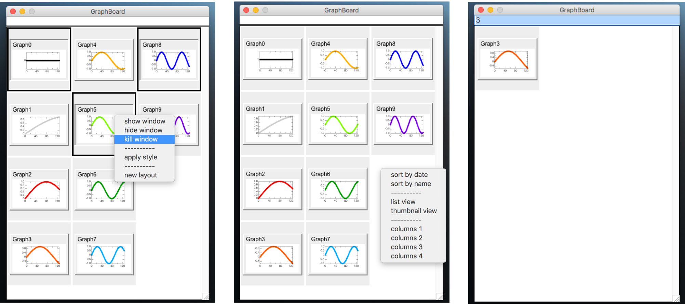

:us: [:jp:](https://github.com/ryotako/igor-GraphBoard/wiki)

[IgorExchange](http://www.igorexchange.com/project/GraphBoard)

# igor-GraphBoard
GraphBoard.ipf provide an alternative graph selecting interface for Igor Pro.



# Features

- Simple user interface
- Filtering with regular expressions
- Extensible popup menu actions

# Installation

Put GraphBoard.ipf into your `Igor Procedures` folder or `User Procedures` folder.
If you use `User Procedures` folder, you have to write `#include "GraphBoard"` on your main procedure window to load the procedure. 

GraphBoard is available from the `Misc` menu.

I recommend defining a keyboard shortcut as follows (choose your favorite number for the short cut).

```igorpro
Menu "Misc"
  "Graph Board/3", /Q, CreateGraphBoard()
End
```

# How to extend popup menu actions
See Wiki(now constracting)
